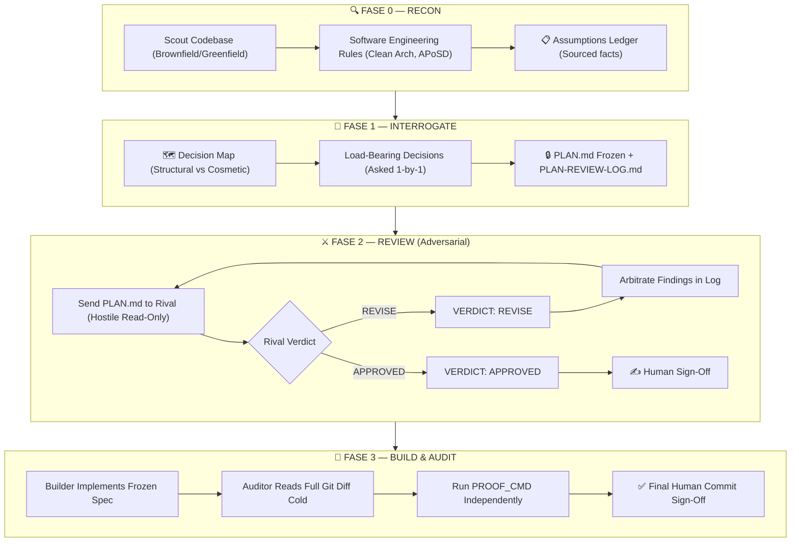

<div align="center">


### Cross-Model Plan Hardening & Collaborative Engineering: Anthropic Claude ⚔️ Google Antigravity (Gemini)

[](https://github.com/Nachei20/claudegravity-loop/actions/workflows/ci.yml)
[](LICENSE)
[](https://claude.ai)
[](https://antigravity.google)

</div>

---

## The Core Law of the System

> **"Whoever designs or builds a piece of software must never grade or audit it."**
>
> When a single AI model plans, implements, and tests its own work, it operates in a cognitive echo chamber. It rarely detects its own hallucinations, blind spots, or race conditions.
>
> **Claudegravity Loop breaks the echo chamber** by pairing **Anthropic Claude** (high-precision reasoning, surgical code diffs) with **Google Antigravity / Gemini** (massive multi-million token context, deep graph reasoning) in a strictly adversarial feedback loop.

---

## Available Skills

This repository includes 4 specialized skills for different phases of cross-model collaboration:

| Skill | Description | Use Case |
|:---|:---|:---|
| **[`claudegravity-loop`](skills/claudegravity-loop/SKILL.md)** | Full 4-phase collaborative plan hardening, adversarial review, and cross-construction. | High-stakes architecture, migrations, schema/auth, concurrency. |
| **[`claudegravity-route`](skills/claudegravity-route/SKILL.md)** | Fast model selector and triage decision matrix. | Deciding whether a task needs Claude, Antigravity, or the full loop. |
| **[`antigravity-review`](skills/antigravity-review/SKILL.md)** | Direct adversarial plan review using Google Antigravity. | You already have a `PLAN.md` and want Antigravity to attack it. |
| **[`antigravity-build`](skills/antigravity-build/SKILL.md)** | Delegated implementation to Antigravity with independent Claude audit. | Antigravity writes the patch; Claude audits diff and tests. |

---

## Bidirectional Role Matrix

Claudegravity Loop is **host-agnostic**: you can start in either **Claude Code** or **Google Antigravity CLI (`agy`)**.

| Host Runtime | Phase 0 & 1 (Plan & Interrogate) | Phase 2 (Adversarial Reviewer) | Phase 3 (Default Builder) | Phase 3 (Final Inspector) |
|---|---|---|---|---|
| **Claude Code** | Current Claude session | **Antigravity** (`agy -p`) | **Claude** | Fresh **Antigravity** session |
| **Antigravity CLI** | Current Antigravity session | **Claude** (`claude -p`) | **Antigravity** | Fresh **Claude** session |

> Either model can be assigned as builder using `builder=claude` or `builder=antigravity`. The inspector **always** follows the non-builder model.

---

## The Four-Phase Workflow



---

## CLI Runner (`claudegravity` v1.1.0)

Claudegravity Loop includes a zero-dependency native JavaScript CLI adapter to automate review rounds, preflight diagnostics, and empirical benchmarks:

```bash
# Check installed CLIs, bridge readiness, and platform invariants
node scripts/runner.mjs preflight

# Run an automated adversarial review with streaming stdin, pre-flight linter, and bounded fallback
node scripts/runner.mjs review --plan PLAN.md --auto-fallback

# Optional flags:
#   --model <name>           Reviewer model override (e.g., 'sonnet', 'opus')
#   --fallback-model <name>  Custom fallback model if primary fails with rate/policy limits
#   --auto-fallback          Automatic 1-hop fallback on CBRN/policy/rate limits
#   --insecure-tls           Opt-in TLS bypass for corporate/local proxies (Warning logged)
#   --track <type>           Phase 3 track: 'code' (worktrees) or 'artifact' (render/extract)
#   --timeout <ms>           Round timeout with clean process tree kill (default: 120000)

# Run the empirical benchmark suite (5/5 passing benchmarks)
npm run benchmark
```

---

## Benchmark Suite (`scripts/benchmark.mjs`)

Empirically validates the performance, stability, and security gains:

| Category | Benchmark | Baseline (v1.0) | Optimized (v1.1) | Status |
|:---|:---|:---|:---|:---:|
| **STABILITY** | Win32 Argv Boundary Elimination | Fails above 32,767 chars (~32 KB) | Stdin stream scales up to 100 KB+ | ✅ PASS |
| **SECURITY** | Scoped TLS Validation Invariant | Unconditional global bypass | Default-secure, opt-in child flag | ✅ PASS |
| **RESILIENCE** | Deterministic 1-Hop Model Fallback | Unbounded retries or crashes | 1-hop failover on verified signals | ✅ PASS |
| **EFFICIENCY** | Pre-flight Consistency Linter | Wasting 5–7 API rounds on math bugs | Sub-millisecond arithmetic intercept | ✅ PASS |
| **TOKENOMICS** | Context Overhead Reduction | Raw XML/blob dumps flooding window | 83.3%–85%+ token reduction via extraction | ✅ PASS |

### Runner Exit Codes
* `0`: **APPROVED** — Plan passed cross-model review with `VERDICT: APPROVED`.
* `2`: **REVISE** — Reviewer identified architectural findings with `VERDICT: REVISE`. Arbitrate in `PLAN-REVIEW-LOG.md`.
* `4`: **LINTER ERROR** — Preflight code-fence balance, unit budget, or arithmetic inconsistency in `PLAN.md`.
* `5`: **BRIDGE ERROR** — Reviewer invocation failure, execution error, or missing verdict tag (never confused with REVISE).
* `124`: **TIMEOUT** — Review execution exceeded `--timeout` limit (clean process tree termination).
* `130`: **INTERRUPTED** — Review cancelled by `SIGINT` (Ctrl+C).

---

## Installation & Setup

### Method A: Install as a Claude Code Plugin
In Claude Code, add the marketplace repository and install:
```bash
/plugin marketplace add Nachei20/claudegravity-loop
/plugin install claudegravity-loop@claudegravity-loop
```

### Method B: Install as a Global Agent Skill
Clone or symlink into your global agent skills directory:
```bash
git clone https://github.com/Nachei20/claudegravity-loop.git ~/.agents/skills/claudegravity-loop
```
Both **Claude Code** and **Google Antigravity CLI** will automatically discover and load the skills.

---

## Document Templates
* **[`ADR-FORMAT.md`](skills/claudegravity-loop/ADR-FORMAT.md)**: Standard template for recording Architectural Decision Records converged during the loop.
* **[`CONTEXT-FORMAT.md`](skills/claudegravity-loop/CONTEXT-FORMAT.md)**: Specification for brownfield context and sourced assumptions ledgers.

---

## License
Licensed under the [Apache License 2.0](LICENSE).
