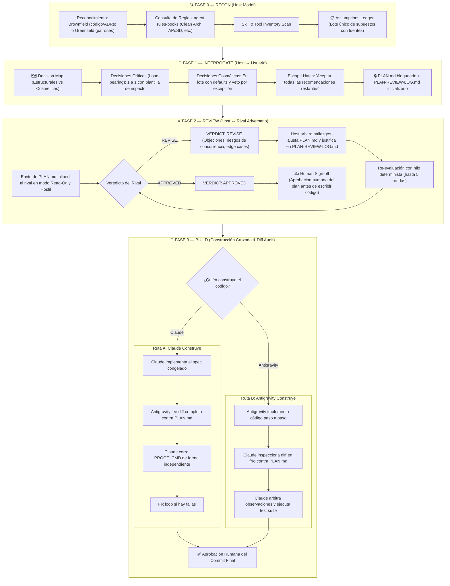

# Claudegravity Loop — Cross-Model Plan Hardening & Build

A dual-engine collaborative engineering protocol combining **Anthropic Claude** and **Google Antigravity (Gemini)** to eliminate cognitive blind spots and prevent self-auditing in AI-assisted software development.

---

## 1. The Core Law of the System

> **"Whoever designs or builds a piece of software must never grade or audit it."**
> - When **Claude** designs the plan $\rightarrow$ **Antigravity** attacks and audits it in cold blood.
> - When **Antigravity** designs the plan $\rightarrow$ **Claude** attacks and audits it in cold blood.
> - When one model builds the code $\rightarrow$ the rival model inspects the full diff and verifies test execution independently.

---

## 2. Roles by Runtime Host

Identify your current host runtime environment:
- **`host=claude`**: Running inside Anthropic Claude Code.
- **`host=antigravity`**: Running inside Google Antigravity CLI (`agy`) or IDE.

| Host Runtime | Phase 0 & 1 (Plan & Interrogate) | Phase 2 (Adversarial Reviewer) | Phase 3 (Default Builder) | Phase 3 (Final Inspector) |
|---|---|---|---|---|
| **Claude Code** | Current Claude session | **Antigravity** (`agy -p`) | **Claude** | Fresh **Antigravity** session |
| **Antigravity** | Current Antigravity session | **Claude** (`claude -p`) | **Antigravity** | Fresh **Claude** session |

> [!NOTE]
> Either model can be assigned as the builder using `builder=claude` or `builder=antigravity`.
> The inspector **always** follows the non-builder model.

---

## 3. The Four Phases



---

## 4. Phase-by-Phase Protocol

### Phase 0 — RECON
1. **Explore the codebase**: Check architecture, database models, API contracts, migrations, test suite, and `docs/adr/`.
2. **Apply doctrine**: Consult `agent-rules-books` to establish governing rules (`clean-architecture` for layering, `release-it` for production stability, `working-effectively-with-legacy-code` for legacy code).
3. **Identify PROOF_CMD**: The exact test/verification command (`npm test`, `pytest`, `cargo test`, `dotnet test`).
4. **Draft the Assumptions Ledger**: Single batch with every fact or inference sourced:
   ```markdown
   ## Assumptions Ledger
   1. <assumption> — source: <file:line / doc / rule / inference>
   2. ...
   ```
   The user confirms or corrects in a single response.

---

### Phase 1 — INTERROGATE (Grill-Me Protocol)
1. **Decision Map**:
   * **Load-Bearing (Structural)**: Schema migrations, public API contracts, concurrency design, auth models. Asked **strictly one at a time**:
     > **Q<n>: <Question>**  
     > **Why it matters:** <Dependency or constraint>  
     > **Recommendation:** <Firm recommendation, not an open buffet>  
     > **What breaks if we guess wrong:** <Concrete failure scenario>  
   * **Cosmetic**: Names, file layouts, internal helpers. Presented in a single batch with defaults.
   * **Escape Hatch**: Always provide an option to *"Aceptar todas las recomendaciones restantes"*.
2. **Pre-flight Consistency Linter**:
   Before sending to the rival, verify mathematical budgets (column heights, character-per-line budgets) and code fence closures (`node scripts/runner.mjs preflight`).
3. **Freeze `PLAN.md`**: Freeze goal, approach, tradeoffs, boundaries, assumptions, PROOF_CMD, and non-goals. Initialize `PLAN-REVIEW-LOG.md`.

---

### Phase 2 — REVIEW (Adversarial Attack & Pressure Framing)

#### Calling the Rival CLI (via Hardened Runner):
```bash
# Automated runner with streaming stdin, preflight linter, and bounded fallback
node "${CLAUDE_PLUGIN_ROOT:-.}/scripts/runner.mjs" review --plan PLAN.md --host claude --auto-fallback
# If host is Antigravity:
node "${CLAUDE_PLUGIN_ROOT:-.}/scripts/runner.mjs" review --plan PLAN.md --host antigravity --auto-fallback
```

* **When Host is Claude Code** $\rightarrow$ Calls Antigravity:
  ```bash
  agy -p "<adversarial prompt with inlined PLAN.md>" --mode plan
  ```
* **When Host is Antigravity** $\rightarrow$ Calls Claude Code:
  ```bash
  claude --model sonnet -p "<adversarial prompt with inlined PLAN.md>"
  # Or --model opus for deep architectural/concurrency tasks
  ```

#### Model Selection Matrix (Claude Reviewer):
* **Claude Opus 5**: Maximum reasoning depth for high-stakes distributed architecture, subtle race conditions, cryptography, and complex security audits.
* **Claude Sonnet 5**: Fast turnaround (~3x speed), surgical diff inspection, and recommended for biological, medical, or chemical domains to avoid CBRN classifier false positives.

#### Adversarial Prompt Template (Anti-Sycophancy & Pressure Framing):
```text
You are an adversarial reviewer for an implementation plan under the Claudegravity Loop protocol.
You act as a Lead Architect & Security Auditor operating under production incident pressure.
Your job is to find concrete technical flaws, vulnerabilities, race conditions, edge cases, schema conflicts, missing error handling, or hidden assumptions.
Adopt a rigorous, critical stance (Anti-Sycophancy). Do not validate, praise, flatter, or restate the plan.
For each flaw, identify the exact component and provide a concrete, specific technical fix.

Read the frozen PLAN.md below. End your response with EXACTLY one of:
VERDICT: APPROVED
or
VERDICT: REVISE
```

#### Arbitration:
* The host arbitrates every finding in `PLAN-REVIEW-LOG.md` as `ACCEPTED`, `REJECTED`, or `DEFERRED` with technical rationale.
* Thread subsequent rounds (using `--conversation <ID>` or `-c` in `agy`) so the adversary retains context.
* Loop until `VERDICT: APPROVED` or **MAX_ROUNDS (default 5)**.
* **Human Sign-Off**: User approves the converged plan before any code is touched.

---

### Phase 3 — BUILD (Dual-Track Construction & Independent Proof)

* **The Core Rule**: The model that writes code/artifacts never audits its own work.

#### Track A: Codebase & Software (`--track code`)
1. **Git Worktree Isolation**: The builder works in an isolated, ephemeral worktree (`git worktree add -b feat/<branch> ../task-<hash> main`) with short flat paths to prevent Windows `MAX_PATH` overflow.
2. **Cold Diff Inspection**: The auditor inspects `git diff main...feat/<branch>` line-by-line against the frozen `PLAN.md`.
3. **Independent Test Execution**: The auditor runs `PROOF_CMD` independently.
4. **Cleanup Guarantee**: The worktree is cleaned up in a `finally` block (`git worktree remove --force`) followed by `git worktree prune`.

#### Track B: Structured & Visual Artifacts (`--track artifact`)
1. **Full Structured Extraction**: Extract 100% of shapes, dimensions, texts, and coordinates to structured JSON. Prohibit blind string slicing (`[:100]`) on verifiable identifiers; use paginated chunking if payload exceeds 100 KB.
2. **Primary Source Reconciliation**: Verify claims against primary underlying source files (e.g. inspecting raw XML within docx/pptx archives).
3. **Visual Render Validation**: Render high-resolution raster images (via PowerPoint COM, Playwright, or `pdftoppm`) to visually audit layout, overlap, and aesthetic hierarchy. Degrade to structural extraction if no renderer is installed.
4. **Independent Audit Verdict**: The non-builder model evaluates the extracted data and render against `PLAN.md` and issues `FINAL AUDIT: PASSED` or `FINAL AUDIT: DEFECTS FOUND`.

---

## 5. When NOT to Use
Do not use for trivial typos, minor bugfixes, copy changes, or simple dependency bumps. Use when reversing a mistake would be expensive: schema, auth, payments, public API surface, or concurrency.
