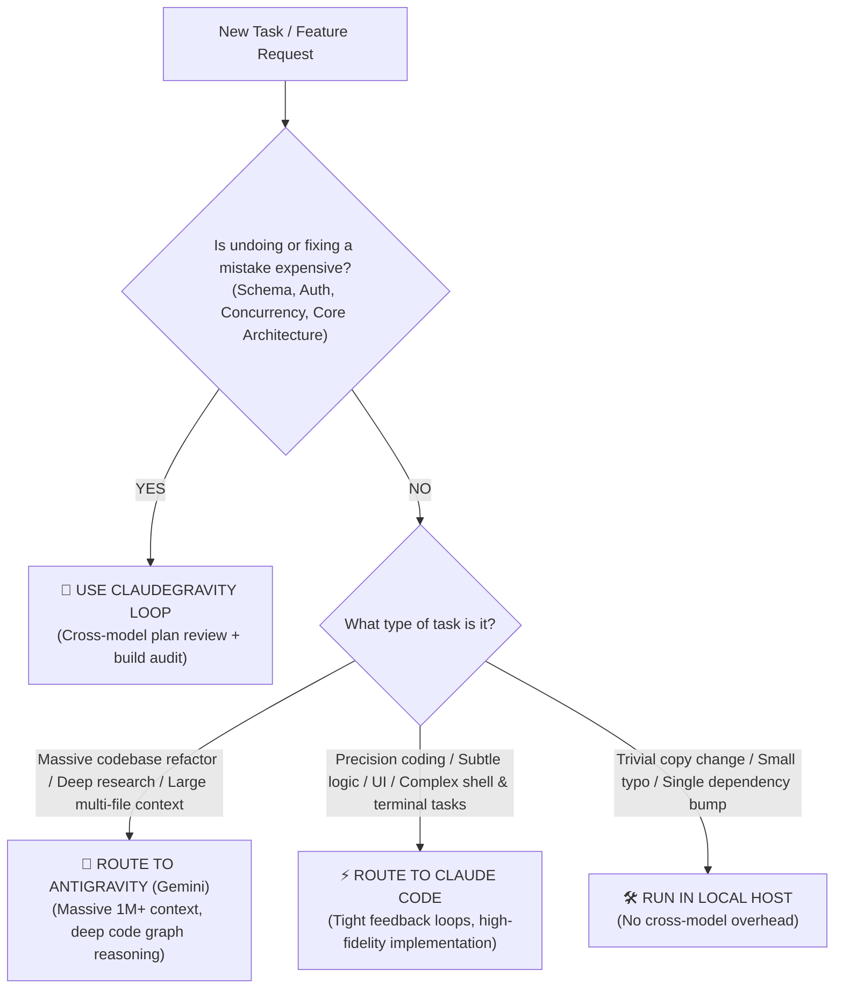

# Claudegravity Route — Task Triage & Model Selector

Use this skill to determine the most effective execution strategy for a given engineering task.

---

## 1. Triage Decision Matrix

---

## 2. Model Strength Profiles

### Anthropic Claude (Claude 3.7 Sonnet / Opus)
* **Best for**:
  - High-precision algorithms and surgical diffs.
  - Complex agentic command loops and shell interaction.
  - Type-safe refactors with immediate compiler feedback.
  - Frontend, CSS, and UI component construction.

### Google Antigravity (Gemini 2.5 Pro / Flash)
* **Best for**:
  - Huge context windows (up to 1M–2M tokens) analyzing entire codebases at once.
  - Architectural pattern discovery and system dependency graphing.
  - Detecting subtle concurrency bugs, race conditions, and distributed systems deadlocks.
  - Autonomous multi-step research and codebase survey.

---

## 3. When to Escalate to `claudegravity-loop`
Escalate immediately if the task involves:
* Schema migrations with zero downtime.
* Authentication, authorization, or cryptographically sensitive code.
* Asynchronous message queues, locks, or transactional boundaries.
* Public API breaking changes or high-traffic legacy rewrites.
